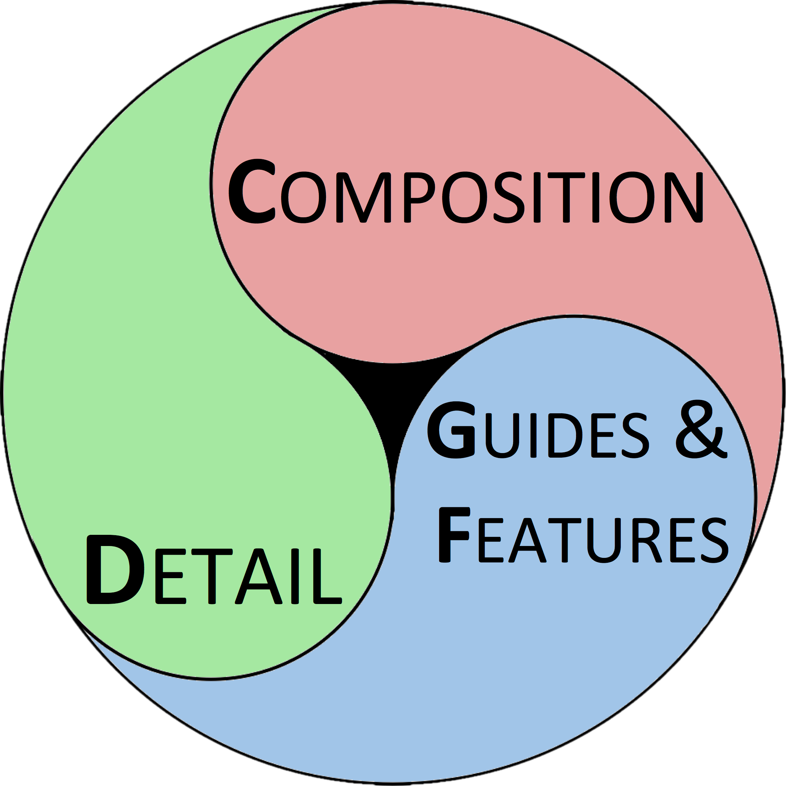

```{r echo = FALSE, message = FALSE, warning = FALSE}
library(knitr)
set.seed(2)
opts_chunk$set(echo = FALSE,
               message = FALSE,
               warning = FALSE,
               cache = TRUE)
```

# </img>

# How do we discuss written work?

## The Lexicon for Writing
A <u>toolbox</u> centered around the question:  
*What message(s) is the writer trying to convey to the reader?*  
<br>
<h3><center>Thesis, Motive, Structure, Key Words, ...  </center></h3>
<br>
Learn more here: http://www.princeton.edu/writing/university/resources/lexicon.pdf

# How do we discuss visual work?

## In General
- "Do this, not that!" method
- Learn by example
- And now... using the Visualization Lexicon!

# VizLex: Lexicon for the Visualization Narrative

##  
</img>  
<h3> The <u>aim</u> of the Visualization Lexicon is to identify how these three elements contribute to the effective communication of a desired <u>narrative/message</u></h3>  

# Composition  

## Composition  
Visual information can frequently be represented in multiple ways; the choice of how to represent this data is the **composition**
  
**i.e.** *What is the best way to **compose** the image in order to represent the data?*

-----
<h2>Different ways to <u>compose</u> a visualization showing the relationship between the carat of a diamond & its price</h2>

## Lineplot

```{r composition_line}
library(xkcd)
library(ggplot2)
library(dplyr)
ggplot() + geom_smooth(aes(x = carat,y = price),data = diamonds,se=FALSE,size=1.5) + 
  xkcdaxis(xrange = c(0,5),yrange = range(diamonds$price),jitteramount=.1) + 
  theme(title = element_text(size = 12)) +
  ggtitle("Line Plot") 
```

## Box Plot
```{r composition_boxplot}
diamonds_binned <- diamonds %>% mutate(carat=cut(carat,labels = seq(1,6,1),breaks=seq(0,6,1))) %>%
  mutate(carat=as.numeric(as.character(carat))) %>% group_by(carat) %>% filter(carat<6)
  
ggplot() + geom_boxplot(aes(x = factor(carat),y = price),data = diamonds_binned) + 
  xkcdaxis(xrange = c(0,5.3),yrange = range(diamonds_binned$price),jitteramount=.1) + 
  theme(title = element_text(size = 12)) +
  ggtitle("Box Plot") + xlab("Carat")

```


## Bar Plot
```{r composition_barplot, dependson="composition_boxplot"}
diamonds_summary <- diamonds_binned %>% group_by(carat) %>% summarise(price = mean(price))
ggplot() + geom_bar(data = diamonds_summary, aes(x = factor(carat),y = price, group=1), stat = "identity") + 
  xkcdaxis(xrange = c(0,5.3),yrange = range(diamonds_binned$price),jitteramount=.1) + 
  theme(title = element_text(size = 12)) +
  ggtitle("Bar Plot") + xlab("Carat")
```

##  
<h2>Other Composition Examples</h2>  
<br>
<div align="left">
  <h4>Comparing Sample Distributions</h4>  
  * Density Plot  
  * Histogram  
  * Box Plot
  </div>

<div align="left">
  <h4>Showing an Image of a Landmark</h4>  
  * Choice of Angle  
  * Photo/Sketch/3D rendering  
</div>

*.. the choice is dependent on the intended message of the visualization*

# Detail

## Detail  
The detail term reflects the amount information that is presented to the viewer. It is a delicate balance aimed at providing enough information to convey the message while limiting extraneous information that may detract from it.  
<br>
**i.e.** *What is the level of **detail** required to convey your message?*

##
<h2>The relationship between the carat of a diamond & its price</h2>  
<h2>...same plots, more <u>detail</u></h2>

## Lineplot  
```{r detail_line}
ggplot() + 
  geom_point(aes(x = carat,y = price),data = diamonds, se = FALSE, size = 1.5, alpha = 0.1) +
  geom_smooth(aes(x = carat,y = price),data = diamonds, se = FALSE, size = 1.5) + 
  xkcdaxis(xrange = c(0,5),yrange = range(diamonds$price), jitteramount = .1) + 
  theme(title = element_text(size = 12)) +
  ggtitle("Line Plot") 
```

## Box Plot  
```{r detail_boxplot, dependson="composition_boxplot"}
ggplot() + geom_boxplot(aes(x = factor(carat),y = price, color = color),data = diamonds_binned) + 
  xkcdaxis(xrange = c(0,5.3),yrange = range(diamonds_binned$price),jitteramount=.1) + 
  theme(title = element_text(size = 12)) +
  ggtitle("Box Plot") + xlab("Carat")

```


## Bar Plot
```{r detail_barplot, dependson="composition_boxplot"}
diamonds_summary <- diamonds_binned %>% group_by(carat,clarity, color) %>% summarise(price = mean(price))
ggplot() + geom_bar(data = diamonds_summary, aes(x = factor(carat),y = price,  fill = color), stat = "identity", position="dodge") + 
  xkcdaxis(xrange = c(0,5.3),yrange = range(diamonds_binned$price),jitteramount=.1) + 
  facet_wrap( ~ clarity) +
  theme(title = element_text(size = 12)) +
  ggtitle("Bar Plot") + xlab("Carat")
```


# Key Features & Guides

## Key Features & Guides  
Abstractly, **key features** are the ideas present in the visualization that directly contribute to the message.
**Guides** are visual cues that direct the viewers attention to the key features.  
<br>
*What features are **key** to convey the message of this visualization?*  
*How do you **guide** the viewer to the Key Features?*

##
<h2>Example message: "Comedy films aren't what they used to be, might as well watch drama!"</h2>  


##
```{r, fig.height = 3, fig.width = 6}
# Terribly simplified, but a great illustration
library(reshape2)
m <- movies %>% select(year,rating,Action:Short) %>% 
  melt(value.name = "type",id.vars = c("year","rating")) %>% filter(type>0) %>% select(-type) %>%
  rename(category = variable) %>%
  group_by(category)
m_filt <- m %>% filter(category %in% c("Drama","Comedy"),year>1914) 

ggplot() +  geom_smooth(aes(year, rating, color = category, linetype = category),
                        data = m_filt, se=FALSE, size = 1.5, method="glm") +   
  xkcdaxis(xrange = range(m_filt$year), yrange = c(5.5, 7), jitteramount = .1) + 
  scale_linetype_manual(values=c("dotted","longdash")) + 
  theme(title = element_text(size = 12)) +
  ggtitle("Drama Preferred over Comedy") +
  ylab("IMDB  Rating")
```

* In this example the most prominent <u>key feature</u> is the relationship between comedy & drama over time
* The elements **color, line type, axis labels, title and legend** act as <u>guides</u> by directing attention and providing the necessary context of this relationship

# Summary

## 
<h2>Using the Visualization Lexicon</h2>
<div align="left">
1. Identify the message(s) that is(are) important to convey to the viewer/reader  
2. Select the **composition** and level of **detail** that captures the relevant information to convey the message  
3. List the **Key Features** of your visualization that the viewer must be aware of  
4. Direct the viewer to the key features using appropriate visual **guides**  
5. Iterate through steps 2-4, each time asking yourself whether your visualization effectively communicates the messages in Step 1  
</div>

## VizLex Handout/Cheatsheet
The Visualization Lexicon is also available in a convenient one-pager:  
http://bit.ly/vizlex_handout

# Cheers!
