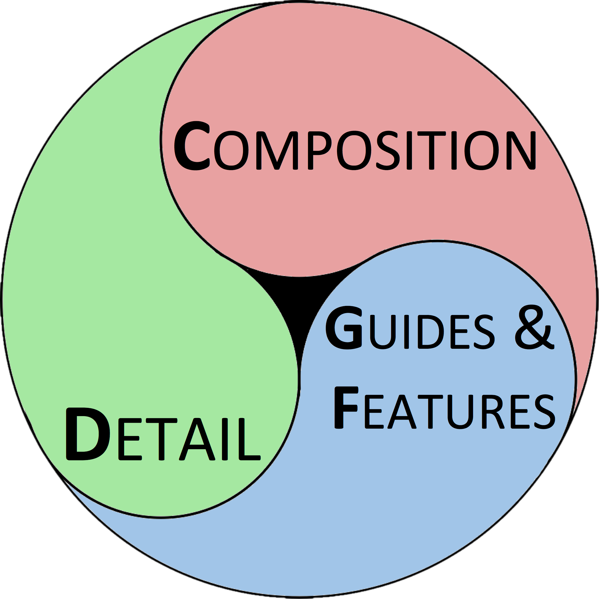

```{r echo = FALSE, message = FALSE, warning = FALSE}
library(knitr)
set.seed(2)
opts_chunk$set(echo = FALSE,
               message = FALSE,
               warning = FALSE,
               cache = TRUE)
```


# How do we discuss written work? <br> <font size="12"><b>TIP:</b> Press "?" for help with navigation</font>

## The Lexicon for Writing
<br>
<h2><center>Thesis, Motive, Structure, Key Words, ...  </center></h2>
Learn more here: http://www.princeton.edu/writing/university/resources/lexicon.pdf

# How do we discuss visual work?

## In General
- "Do this, not that!" method
- Learn by example
- And now... using the Figure Lexicon!

# What is a <u>FIGURE</u>?

## Figure = Visualization + Message
**Visualization**  
a visual interface between the viewer and the data  

**Figure**  
a visualization selected to convey a specific **message(s)**


# The Lexicon for Figures: FigLex

##  
</img>  
<h3> The <u>aim</u> of the Figure Lexicon is to identify how these three elements of a visualization contribute to the effective communication of a message</h3>  
# Composition  

## Composition  
Visual information can frequently be represented in multiple ways; the choice of how to view this data is the composition.  
  
**i.e.** *What is the best way to **compose** the image in order to represent the data?*

-----
<h2>Different ways to <u>compose</u> a figure showing the relationship between the carat of a diamond & its price</h2>

## Lineplot

```{r composition_line}
library(xkcd)
library(ggplot2)
library(dplyr)
ggplot() + geom_smooth(aes(x = carat,y = price),data = diamonds,se=FALSE,size=1.5) + 
  xkcdaxis(xrange = c(0,5),yrange = range(diamonds$price),jitteramount=.1) + 
  theme(title = element_text(size = 12)) +
  ggtitle("Line Plot") 
```

## Box Plot
```{r composition_boxplot}
diamonds_binned <- diamonds %>% mutate(carat=cut(carat,labels = seq(1,6,1),breaks=seq(0,6,1))) %>%
  mutate(carat=as.numeric(as.character(carat))) %>% group_by(carat) %>% filter(carat<6)
  
ggplot() + geom_boxplot(aes(x = factor(carat),y = price),data = diamonds_binned) + 
  xkcdaxis(xrange = c(0,5.3),yrange = range(diamonds_binned$price),jitteramount=.1) + 
  theme(title = element_text(size = 12)) +
  ggtitle("Box Plot") + xlab("Carat")

```

## Bar Plot
```{r composition_barplot, dependson="composition_boxplot", eval=FALSE}
diamonds_binned %>% group_by()
ggplot() + geom_bar(data = diamonds_binned, aes(x = factor(carat),y = price, group=1), stat = "identity")
+ 
  xkcdaxis(xrange = c(0,5.3),yrange = range(diamonds_binned$price),jitteramount=.1) + 
  theme(title = element_text(size = 12)) +
  ggtitle("Bar Plot") + xlab("Carat")
```


